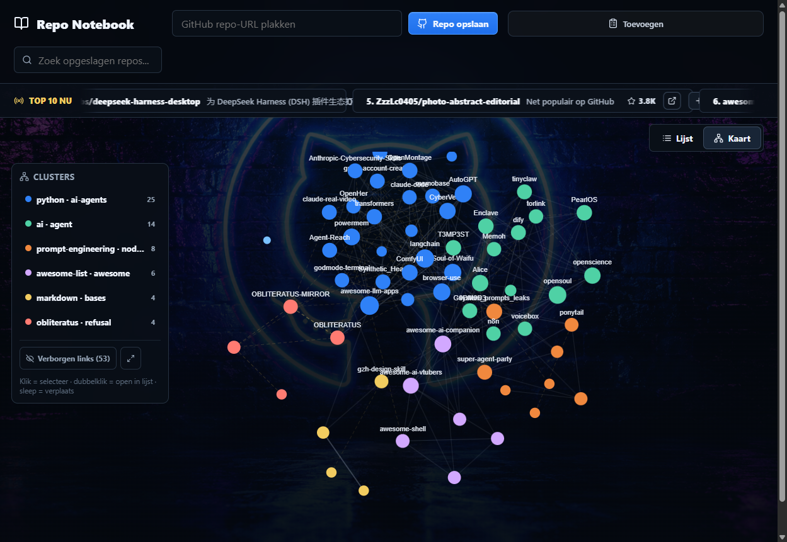
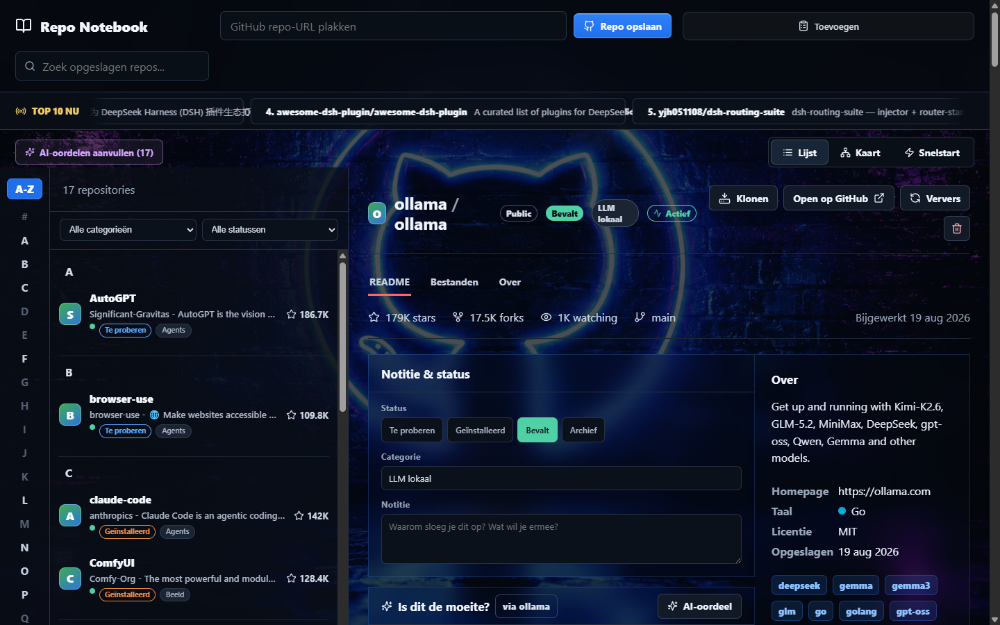

# Repo Notebook

🌐 **Website:** [thomashuybrechts.com/repo-notebook](https://thomashuybrechts.com/repo-notebook/) · 👤 Built by [Thomas Huybrechts](https://thomashuybrechts.com/)

Repo Notebook is a local desktop app (and plain Node app) for the GitHub repositories you want to *try*, not just star. Paste a URL and it saves the repo with metadata and README; one click more and it clones, detects how the project runs, installs it and starts it — with live logs, in one window. Everything stays on your machine in a single JSON file.



## Features

**The shelf**
- Paste a GitHub URL (or `owner/repo`) → metadata, topics, license, stars and the README are stored locally, sorted A–Z like an old-school address book.
- Bulk add: paste any text (a post, a newsletter) and every `github.com/owner/repo` in it is saved. Import your GitHub stars. Export/import the whole notebook as JSON.
- Live **Top 10 now** ticker with trending repos — one click saves one to the shelf.
- Per repo: category, status (*try / installed / keep / archive*), your own note, a health badge (active / quiet / stale / archived from the last push), duplicate detection against your other clone folders, and search that also looks inside READMEs.



- **Knowledge-graph map**: the app links your repos by shared topics, README/description similarity (TF-IDF), same author/category/language, and explains every link. Label propagation groups them into named clusters; links that only the text reveals are shown as *hidden links*. Click a node for the "why", double-click to open it in the list. A "Related repos" panel shows the same for the selected repo.

**Run it**
- Clone into the app's own folder, then the app detects the stack — Node, Python, Rust, Go, Docker Compose, Make — and offers install / start / stop with live logs. It sniffs the dev-server URL from the output and offers **Open in browser**.
- Python installs always go into a `.venv` inside the clone — never your global site-packages.
- **Quick start tab**: every clone as a card with start/stop, PID and uptime, URL, "open folder" and "jump to list"; a port guard warns when two running repos want the same port; "check all updates" fetches every clone and shows how many commits behind each one is (pull from the app).
- `.env` editor per clone (with `.env.example` as template), git pull, disk size per clone, delete clone.
- **Terminal** per cloned repo: a drawer with a persistent shell (PowerShell on Windows, your `$SHELL` elsewhere) that starts in the clone folder — `git status`, an npm script, a quick look around — without leaving the app.
- Optional **container mode** (opt-in per repo): install and run inside Docker (node / python / golang / rust base images, or the repo's own compose file), clone bind-mounted, ports mapped, optional GPU; Docker Desktop is started on demand.

**AI, agents, Obsidian**
- **"Is this worth it?"** verdict per repo — local **Ollama** by default (zero tokens), Anthropic or OpenAI optional. Bulk verdicts for everything you saved (only with a local provider unless you force it).
- **MCP server**: `list_saved_repos`, `save_repo`, `bulk_save`, `search_github`, `clone_repo`, `trending_repos`, `set_repo_meta`, `remove_repo` — Claude Code, Codex or any MCP client drives the same shelf. Two transports: **stdio** (`npm run mcp` / `.mcp.json` / `claude mcp add repo-notebook -- node mcp/server.js`) and **Streamable HTTP** at `http://127.0.0.1:<port>/mcp` while the app runs (`claude mcp add --transport http repo-notebook http://127.0.0.1:5188/mcp`). The **MCP** chip in the app shows the live endpoint and copy-ready commands; the endpoint stays behind the loopback guard.
- **Obsidian plugin** (`obsidian-plugin/`): every saved repo becomes a note, the graph links become `[[wikilinks]]` (your repo map in Obsidian's graph view), a side panel with clone/install/start/stop, and two-way status/category/notes sync through the same data file. See [obsidian-plugin/README.md](obsidian-plugin/README.md).

## Run

```bash
npm install
npm run dev          # dev server + Vite, http://127.0.0.1:5188
```

Desktop app (Electron, same server in its own window):

```bash
npm run app          # start
npm run app:build    # build the Windows installer (electron-builder, output in release/)
```

On Windows you can also double-click `Start Repo Notebook.bat`. The app needs `git` on your PATH; `python` for Python repos; Docker Desktop only for container mode.

Data lives in `%LOCALAPPDATA%\RepoNotebook\data` (`notebook.json`, `clones/`, `runs/`, `server.log`) — or wherever `RN_DATA_DIR` points. The server writes `server.json` (port, pid, MCP endpoint) next to it on start so clients such as the Obsidian plugin can find the desktop app, which uses port 5188 when free and any free port otherwise. Opening `/#repo=owner/name` selects that repo in the UI.

## Security & privacy

Repo Notebook runs entirely on your own machine and binds to `127.0.0.1` only. Because it can **clone, install and run** the repositories you save, it executes third-party code that you choose — treat it like running any repo locally. The local server rejects requests from other origins/hosts (CSRF + DNS-rebinding guard; only its own origin and the Obsidian plugin's `app://obsidian.md` are allowed), so a website you visit cannot drive it. Your saved repos, clones and any tokens stay local (see `.gitignore`); nothing is uploaded.

Optional environment variables:

- `GITHUB_TOKEN` — higher GitHub API rate limit and access to private repos.
- `RN_DATA_DIR` — data folder (default `%LOCALAPPDATA%\RepoNotebook\data`). `PORT` — server port (default 5188; the desktop app picks a free one).
- `RN_AI_PROVIDER` — `ollama` (default, local, no tokens) · `anthropic` · `openai`. `RN_AI_MODEL` — model name. `RN_OLLAMA_URL` / `OLLAMA_HOST` — where Ollama listens. `ANTHROPIC_API_KEY` / `OPENAI_API_KEY` / `OPENAI_BASE_URL` — only for those providers.
- `RN_TERMINAL_SHELL` — shell for the embedded terminal (default `powershell.exe` on Windows, `$SHELL` elsewhere).
- `RN_EXTRA_CLONE_DIRS` — extra folders (`;`-separated) scanned for duplicate clones (default: none; a missing folder is skipped).

## Notes

This app is intended for public repositories. Private repositories may require GitHub credentials for both API access and cloning. More background: [docs/product/repo-notebook.md](docs/product/repo-notebook.md) and [docs/architecture/local-app.md](docs/architecture/local-app.md).

MIT © Thomas Huybrechts
